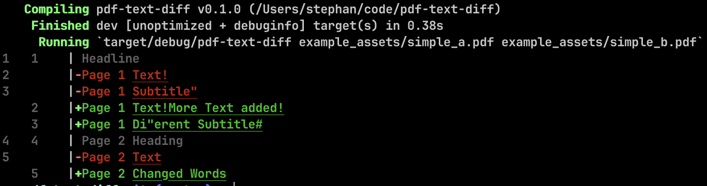

# pdf-text-diff

extracts raw text from two PDFs and shows a text-based diff:

usage:

```
cargo r -- pdfs/simple_a.pdf pdfs/simple_b.pdf
```

compares [simple_a.pdf](pdfs/simple_a.pdf) with [simple_b.pdf](pdfs/simple_b.pdf):



## dependencies:

* [pdf](https://crates.io/crates/pdf) for the PDF parsing
* [similar](https://crates.io/crates/similar) for the text diffing
